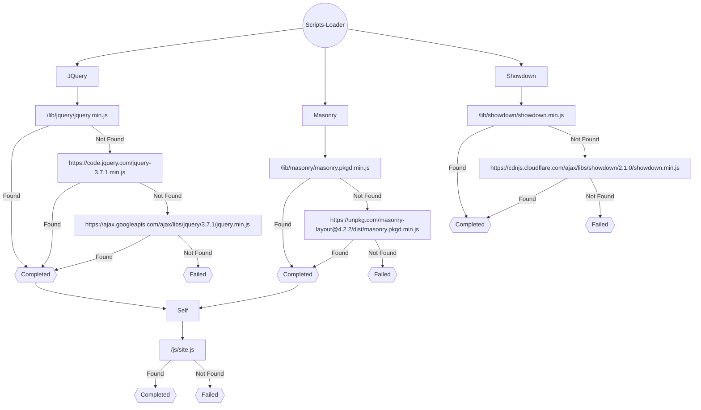

# Scripts Loader

## Overview

The Scripts Loader is a lightweight and adaptable script loader library crafted specifically to dynamically load JavaScript files within web applications. Its versatile nature simplifies script management, adeptly handles dependencies, and ensures the seamless integration of external scripts. With its flexible loading strategies, it provides a reliable solution for effortlessly managing script loading complexities, empowering developers to streamline their web application development process.

> [!NOTE]
> While the library supports TypeScript during development, the released version includes only JavaScript files, a map file, and typescript declaration file for type definiton. This ensures ease of use without additional dependencies or frameworks.

## Purpose

Ever experienced the frustration of repeatedly pressing <kbd>Ctrl</kbd> + <kbd>F5</kbd> on a website, only for certain JavaScript files that refuse to load? The Scripts Loader is a reliable solution to this common issue faced during script loading via HTML. The challenge often arises from the JavaScript files—while some stand independently, others depend on additional files for proper execution. This variation in dependencies leads to inconsistent behavior, causing script failures that disrupt entire web applications. Our library encounters these challenges head-on, ensuring seamless and dependable script loading without the bother of missing dependencies.

With innate support for both JSON and XML syntaxes, integrating and utilizing this library becomes effortlessly intuitive. Its user-friendly design empowers developers to manage and load scripts effortlessly, simplifying even the most complex dependencies. Bid farewell to wrestle with intricate script loading processes—the Scripts Loader streamlines integration, offering a dependable and streamlined solution.

### Why No CSS Support?

Curious why CSS support isn't part of this library. Unlike JavaScript files that demand precise dependency handling, CSS files, dynamically loaded, tend to be more self-contained. Typically, CSS files don't heavily rely on external dependencies for their functionality; they can often resolve themselves even if additional dependencies aren't explicitly specified.

By focusing specifically on JavaScript loading and dependency management, our library addresses the critical challenges associated with script loading, maintaining simplicity, and effectiveness in handling intricate JavaScript dependencies.

## Installation
### Download
Get our latest [release files](https://github.com/Mubarrat/scripts-loader/releases) directly from this GitHub repository.

#### Contents
Download and extract it, you'll find a structure like this:
```
scripts-loader
├── scripts-loader.d.ts
├── scripts-loader.d.ts.map
├── scripts-loader.js
├── scripts-loader.js.map
├── scripts-loader.min.js
└── scripts-loader.min.js.map
```

### Link
For direct access:
```
https://cdn.jsdelivr.net/gh/Mubarrat/scripts-loader@1.x/dist/scripts-loader.js
```
For the minimized version:
```
https://cdn.jsdelivr.net/gh/Mubarrat/scripts-loader@1.x/dist/scripts-loader.min.js
```

### For npm Installation
Visit our [package page](https://github.com/Mubarrat/scripts-loader/pkgs/npm/scripts-loader).

## Implementation and Result

### Implementation
```json
[
  {
    "name": "JQuery",
    "sources": [
      "/lib/jquery/jquery.min.js",
      "https://code.jquery.com/jquery-3.7.1.min.js",
      "https://ajax.googleapis.com/ajax/libs/jquery/3.7.1/jquery.min.js"
    ]
  },
  {
    "name": "Masonry",
    "sources": [
      "/lib/masonry/masonry.pkgd.min.js",
      "https://unpkg.com/masonry-layout@4.2.2/dist/masonry.pkgd.min.js"
    ]
  },
  {
    "name": "Showdown",
    "sources": [
      "/lib/showdown/showdown.min.js",
      "https://cdnjs.cloudflare.com/ajax/libs/showdown/2.1.0/showdown.min.js"
    ]
  },
  {
    "name": "Self",
    "source": "/js/site.js",
    "dependencies": [
      "JQuery",
      "Masonry"
    ]
  }
]
```
### Result


## Guides

Dive into our comprehensive guides and documentation available in our [Wiki](https://github.com/Mubarrat/scripts-loader/wiki) for detailed instructions and essential resources:

- **Installation Guide**: Seamless steps to integrate the Scripts Loader into your project.
- **Usage Examples**: Practical demonstrations featuring various implementation scenarios.
- **API Documentation**: Detailed insights into available APIs, parameters, and usage guidelines.
- **Troubleshooting**: Solutions to common issues, error handling, and FAQs for a smoother development journey.

Explore our [Wiki](https://github.com/Mubarrat/scripts-loader/wiki) to supercharge your coding experience with the Scripts Loader!

## Schemas for IDE Use

For developers operating within Integrated Development Environments (IDEs), these schemas offer structured formats to enhance the editing experience:

1. [JSON Schema](https://cdn.jsdelivr.net/gh/Mubarrat/scripts-loader@main/schema.json)
   - JSON format schema for validation and code hinting in compatible IDEs.

2. [XSD Schema](https://cdn.jsdelivr.net/gh/Mubarrat/scripts-loader@main/schema.xsd)
   - XSD format schema aiding XML-based editing environments, facilitating validation and autocomplete functionalities.

These schemas prove invaluable, ensuring script compatibility, validating configurations, and enhancing the overall development process within supported IDEs.

## Contributing

We enthusiastically welcome contributions to enrich the Scripts Loader library. Whether it's fixing a bug, implementing new features, or improving documentation, your efforts are immensely appreciated. To contribute, follow these guidelines:

### Bug Reports and Feature Requests

If you encounter a bug or have a feature request, check our [issue tracker](https://github.com/Mubarrat/scripts-loader/issues) to see if it's already reported. If not, feel free to open a new issue. When reporting a bug, include:

- A clear and descriptive title
- Steps to reproduce the bug
- Expected behavior versus observed behavior
- Any relevant code snippets, error messages, or screenshots

For feature requests, outline the proposed feature's functionality and potential benefits.

### Pull Requests

We encourage pull requests for bug fixes, documentation improvements, or new features. Follow these steps:

1. Fork the repository and create a new branch from the `main` branch.
2. Implement your changes, ensuring they align with our coding standards and practices.
3. Write clear commit messages that describe the changes made.
4. Thoroughly test your changes.
5. Submit a pull request (PR) and provide a detailed description:
   - Explain the problem solved or the feature added.
   - Reference related issues, if any.

### Code Contribution Guidelines

- Maintain consistent coding styles in line with the repository's standards.
- Use descriptive comments where necessary to enhance clarity.
- Ensure that your code changes don't introduce new issues or break existing functionality.
- Update documentation if your changes impact it.

### Code of Conduct

Adhere to our [Code of Conduct](Code_oF_Conduct.md) in all project-related interactions.

### Seeking Assistance

For help or clarification on contributing, feel free to reach out by [creating an issue](https://github.com/Mubarrat/scripts-loader/issues).

Thank you for considering contributing to the Scripts Loader library!
